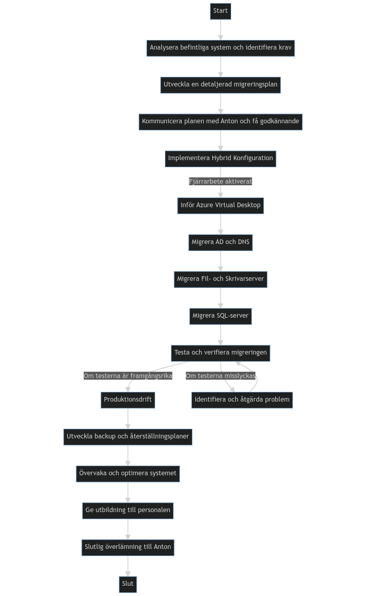

I uppgift #4 var mitt mål att skriva en migreringsplan för Antons Motorolja AB.
Nedan följer en redogörelse av de steg jag tog för att uppnå detta, utmaningar jag stötte på, samt reflektioner och lärdomar jag fick under processen.
Migreringsplanen är skriven utifrån perspektivet att den ska lämnas in till Anton på Antons Motorolja AB.

# Introduktion

Antons Motorolja AB står inför en spännande period av digital transformation med en planerad migrering till Microsoft Azure. Syftet med denna migrering är att modernisera företagets IT-infrastruktur, öka flexibiliteten och skalbarheten, samt möjliggöra fjärrarbete för de anställda under de tidigare rådande omständigheter(Covid-19) och framöver. Denna migreringsplan är utformad för att säkerställa en smidig övergång till Azure med minimal påverkan på den dagliga verksamheten. Planen har delats upp i flera faser som tar hänsyn till både tekniska och organisatoriska aspekter av migreringsprocessen. Varje fas har specifika mål, aktiviteter och tilldelade Azure-resurser, för att säkerställa en strukturerad och välorganiserad migreringsprocess.

# Förberedelser

- **Tidsuppskattning:** 1-2 veckor
- **Produktionsstopp:** Nej
- **Aktiviteter:**
  - Insamling och dokumentation av teknisk information om befintliga system och arbetsflöden.
  - Teknisk utvärdering av Azure-tjänster.
  - Upprättande av en detaljerad migreringsplan.
  - Utbildning av personal om Azure och hybrid arbetsmiljöer.
- **Azure Resurser:**
  - Inga resurser skapas under detta steg.

---

## Innehållsförteckning
- [Introduktion](#introduktion)
- [Förberedelser](#förberedelser)
  - [Innehållsförteckning](#innehållsförteckning)
  - [Flödesschema](#flödesschema)
  - [Migreringsplan](#migreringsplan)
    - [1. Konfigurering av Azure Miljö](#1-konfigurering-av-azure-miljö)
    - [2. Hybrid Konfiguration](#2-hybrid-konfiguration)
    - [3. Migrering av Data och Applikationer](#3-migrering-av-data-och-applikationer)
    - [4. Testning och Validering](#4-testning-och-validering)
    - [5. Optimering och Finjustering](#5-optimering-och-finjustering)
    - [6. Överlämning och Utbildning](#6-överlämning-och-utbildning)
  - [Resurser som inte kommer att migreras eller tas bort](#resurser-som-inte-kommer-att-migreras-eller-tas-bort)
    - [RCO Passersystem](#rco-passersystem)
    - [Brandvägg (Cisco)](#brandvägg-cisco)
    - [Printer (Scan till folder, Scan till e-post)](#printer-scan-till-folder-scan-till-e-post)
    - [Ethernet Nätverk och WiFi (inklusive roaming)](#ethernet-nätverk-och-wifi-inklusive-roaming)
    - [Klientdatorer](#klientdatorer)
  - [Perspektiv på resurser, kostnader och säkerhet](#perspektiv-på-resurser-kostnader-och-säkerhet)
    - [Övergripande analys](#övergripande-analys)
      - [Generellt Perspektiv](#generellt-perspektiv)
      - [Ekonomiskt Perspektiv](#ekonomiskt-perspektiv)
      - [Säkerhetsmässigt Perspektiv](#säkerhetsmässigt-perspektiv)
    - [Djupare analys av Azure-resurser och tjänster](#djupare-analys-av-azure-resurser-och-tjänster)
      - [Azure-prenumeration](#azure-prenumeration)
      - [Resursgrupper](#resursgrupper)
      - [Virtuella nätverk](#virtuella-nätverk)
      - [Nätverkssäkerhetsgrupper](#nätverkssäkerhetsgrupper)
      - [VPN Gateway eller Azure ExpressRoute](#vpn-gateway-eller-azure-expressroute)
      - [Azure AD](#azure-ad)
      - [Azure Virtual Desktop](#azure-virtual-desktop)
      - [Azure File Sync och/eller Azure Blob Storage](#azure-file-sync-ocheller-azure-blob-storage)
      - [Azure SQL Database eller Azure SQL Managed Instance](#azure-sql-database-eller-azure-sql-managed-instance)
      - [Azure Migrate](#azure-migrate)
      - [Azure Monitor och Azure Security Center](#azure-monitor-och-azure-security-center)
      - [Azure Cost Management och Azure Policy](#azure-cost-management-och-azure-policy)
      - [Azure DevOps](#azure-devops)

---
## Flödesschema

---

## Migreringsplan
***För en mer övergripande analys av varje indviduell Azure resurs se sektionen*** -> [Djupare analys av Azure-resurser och tjänster](#djupare-analys-av-azure-resurser-och-tjänster)

### 1. Konfigurering av Azure Miljö
- **Tidsuppskattning:** 1 vecka
- **Produktionsstopp:** Nej
- **Aktiviteter:**
  - Skapande av Azure-prenumeration och resursgrupper.
  - Konfiguration av virtuella nätverk och säkerhetsgrupper.
- **Azure Resurser:**
  - Azure-prenumeration
  - Resursgrupper
  - Virtuella nätverk
  - Nätverkssäkerhetsgrupper
- **Ekonomiskt Perspektiv:**
  - Genom att initiera en Azure-prenumeration och skapa resursgrupper, läggs grunden för en organiserad och skalenlig resurshantering som är kostnadseffektiv. 
    Virtuella nätverk och säkerhetsgrupper minimerar behovet av en fysisk nätverksinfrastruktur, vilket reducerar de relaterade kapital- och driftkostnaderna.
- **Säkerhetsmässigt Perspektiv:**
  - Konfigureringen av virtuella nätverk och säkerhetsgrupper är kritisk för att säkerställa en isolerad och säker miljö för företagets resurser och data. 
    Denna konfiguration lägger grunden för säkerhetspolicyer och åtkomstkontroller som kommer att implementeras i senare faser av migreringsprocessen.

### 2. Hybrid Konfiguration
- **Tidsuppskattning:** 1-2 veckor
- **Produktionsstopp:** Minimal
- **Aktiviteter:**
  - Konfiguration av VPN eller ExpressRoute.
  - Upprättande av hybrid identitetslösning.
  - Implementering av fjärrarbetslösningar med Azure Virtual Desktop.
- **Azure Resurser:**
  - VPN Gateway eller Azure ExpressRoute
  - Azure AD
  - Azure Virtual Desktop
- **Ekonomiskt Perspektiv:**
  - Skapandet av en hybridkonfiguration genom VPN eller ExpressRoute anslutningar möjliggör en smidig övergång till molnet och underlättar fjärrarbete, vilket kan leda till ökad produktivitet och minskade driftkostnader. 
    Dessutom tillåter en hybrid identitetslösning företaget att maximera användningen av befintliga investeringar i on-prem teknik samtidigt som man förbereder sig för en fullständig övergång till molnet.
- **Säkerhetsmässigt Perspektiv:**
  - Etablering av säkra anslutningar och identitetshantering i denna fas är kritisk för att säkerställa en säker och efterlevnadskompatibel hybrid infrastruktur. 
    Detta inkluderar att ha robusta autentiserings- och auktoriseringsprocesser på plats, som både stödjer säkerheten och underlättar överensstämmelse med regulatoriska krav.

### 3. Migrering av Data och Applikationer
- **Tidsuppskattning:** 2-4 veckor
- **Produktionsstopp:** Planerade under lågtrafiktid eller helger
- **Aktiviteter:**
  - Migrering av filer till Azure med Azure File Sync och/eller Azure Blob Storage.
  - Migrering av SQL-databasen till Azure SQL.
  - Migrering av virtuella maskiner till Azure med Azure Migrate.
- **Azure Resurser:**
  - Azure File Sync och/eller Azure Blob Storage
  - Azure SQL Database eller Azure SQL Managed Instance
  - Azure Migrate
- **Ekonomiskt Perspektiv:**
  - Migrering till molnbaserade lagrings- och databaslösningar som Azure File Sync, Azure Blob Storage och Azure SQL kan leda till kostnadsbesparingar genom optimerad resursanvändning och minskad lokal infrastrukturunderhåll. 
    Denna fas ger också möjlighet till kostnadseffektiv skalbarhet och flexibilitet som molntjänster erbjuder, vilket möjliggör för företaget att snabbt anpassa sig till ändrade affärsbehov.
- **Säkerhetsmässigt Perspektiv:**
  - Det är kritiskt att säkerställa säker dataöverföring och korrekt konfiguration av tillgångskontroller under denna fas av migreringsprocessen. 
    Dataskydd och efterlevnad måste upprätthållas genom att följa bästa praxis för dataskydd, kryptering och säkerhetspolicyer som hjälper till att skydda mot potentiella säkerhetshot.

### 4. Testning och Validering
- **Tidsuppskattning:** 2-4 veckor
- **Produktionsstopp:** Nej
- **Aktiviteter:**
  - Kontroll av systemfunktionalitet och prestanda.
  - Validering av säkerhets- och integritetskonfigurationer.
  - Feedbackinsamling och justeringar baserat på feedback.
- **Azure Resurser:**
  - Azure Monitor
  - Azure Security Center
- **Ekonomiskt Perspektiv:**
  - Genom att utföra noggrann testning och validering kan eventuella problem identifieras och åtgärdas tidigt, vilket minimerar de långsiktiga kostnaderna för felsökning och underhåll. 
    Feedback och justeringar baserade på denna feedback är värdefulla för att säkerställa att systemet är kostnadseffektivt, presterar väl och möter affärsbehoven.
- **Säkerhetsmässigt Perspektiv:**
  - Korrekt validering i denna fas säkerställer att alla säkerhetsprotokoll och dataskyddsåtgärder fungerar som avsett. 
    Detta inkluderar att kontrollera systemets säkerhets- och integritetskonfigurationer, och att säkerställa att det finns tillräckliga skyddsåtgärder mot potentiella säkerhetshot och överträdelser av dataskydd.

### 5. Optimering och Finjustering
- **Tidsuppskattning:** Ongoing
- **Produktionsstopp:** Nej
- **Aktiviteter:**
  - Övervakning av systemprestanda och säkerhet.
  - Optimering av resursanvändning och kostnadskontroll.
  - Uppdatering och underhåll av dokumentation.
- **Azure Resurser:**
  - Azure Cost Management
  - Azure Policy
- **Ekonomiskt Perspektiv:**
  - Att kontinuerligt övervaka och optimera systemprestanda samt resursanvändning med hjälp av verktyg som Azure Cost Management och Azure Policy kan leda till avsevärda kostnadsbesparingar över tid. 
    Detta inkluderar att identifiera och eliminera underutnyttjade resurser, samt att säkerställa att systemet är konfigurerat för optimal kostnadseffektivitet. 
    Uppdatering och underhåll av dokumentationen är också avgörande för att minska framtida underhålls- och felsökningskostnader.
- **Säkerhetsmässigt Perspektiv:**
  - Övervakning av systemets säkerhetsstatus och snabb åtgärd av identifierade säkerhetsproblem är centralt för att upprätthålla en robust säkerhetspostur. 
    Azure Policy kan hjälpa till att säkerställa efterlevnad av företagets säkerhetspolicyer och branschstandarder genom att automatiskt övervaka och rapportera om avvikelser från de definierade policyerna.

### 6. Överlämning och Utbildning
- **Tidsuppskattning:** 1-2 veckor
- **Produktionsstopp:** Nej
- **Aktiviteter:**
  - Överlämning av drift och underhåll till intern personal eller tredje part.
  - Fortsatt utbildning och stöd till personal och Anton.
- **Azure Resurser:**
  - Azure DevOps (för kontinuerlig drift och underhåll)
- **Ekonomiskt Perspektiv:**
  - En välorganiserad överlämning och utbildningsprocess minimerar risken för driftstopp och relaterade kostnader genom att säkerställa att intern personal 
    eller tredjepartsleverantörer är välutbildade och förberedda för att effektivt hantera drift och underhåll av Azure-miljön. 
    Fortsatt utbildning och stöd till personalen är en investering som kan leda till ökad produktivitet och minskad felsöknings- och underhållstid.
- **Säkerhetsmässigt Perspektiv:**
  - Utbildning av personalen i bästa praxis för säkerhet och användning av verktyg som Azure DevOps för kontinuerlig drift och underhåll, säkerställer att 
    personalen är utrustad med kunskap och verktyg som behövs för att upprätthålla en stark säkerhetspostur och reagera effektivt på potentiella säkerhetshot. 
    En korrekt överlämning inkluderar också säkerställande av att alla säkerhetsprotokoll, policyer och åtkomstkontroller är korrekt dokumenterade och kommunicerade till de ansvariga parterna.

---

## Resurser som inte kommer att migreras eller tas bort

### RCO Passersystem
- **Anledning:** 
  - RCO passersystem är en lokal hårdvarubaserad lösning som hanterar åtkomstkontroll till företagets fysiska utrymmen. Detta system behöver vara på plats lokalt för att säkerställa omedelbar och kontinuerlig åtkomstkontroll. Migrering till Azure kan leda till fördröjningar eller potentiella avbrott i åtkomstkontrollsystemet, vilket kan utgöra en säkerhetsrisk.
  - Detta innebär att en tillräcklig lokal server måste finnas kvar för att hantera åtkomstkontrollen. Detta kommer att vara en del av den hybridlösning som kommer att implementeras i fas 2 av migreringsprocessen.

### Brandvägg (Cisco)
- **Anledning:** 
  - Den befintliga brandväggen är en kritisk komponent för företagets nätverkssäkerhet och skyddar företagsnätverket från obehörig åtkomst och andra säkerhetshot. Även om Azure erbjuder sina egna säkerhetslösningar och brandväggstjänster, kan det vara fördelaktigt att behålla den befintliga brandväggen på plats som en extra säkerhetsåtgärd och för att upprätthålla vissa specifika säkerhetspolicyer och konfigurationer.

### Printer (Scan till folder, Scan till e-post)
- **Anledning:** 
  - Printers och deras associerade tjänster (såsom scanning till mapp och e-post) är ofta beroende av lokal nätverksinfrastruktur för snabb och effektiv funktionalitet. Migrering av dessa tjänster till Azure kan leda till fördröjningar och komplexitet i konfiguration och felsökning, särskilt när det gäller att säkerställa korrekt nätverksrouting och åtkomstbehörigheter.

### Ethernet Nätverk och WiFi (inklusive roaming)
- **Anledning:** 
  - Lokala nätverksresurser som Ethernet och WiFi är kritiska för daglig verksamhet och måste fortsätta att fungera på plats för att säkerställa stabil och tillförlitlig nätverksanslutning för alla enheter och system.

### Klientdatorer
- **Anledning:** 
  - De lokala klientdatorerna är nödvändiga för dagliga arbetsuppgifter och även om en del arbete kan flyttas till fjärrarbetslösningar som Azure Virtual Desktop, kommer det fortfarande att vara behov av lokal hårdvara för vissa uppgifter och applikationer.

Genom att behålla dessa kritiska on-prem resurser kan Antons Motorolja AB säkerställa kontinuerlig, säker och effektiv drift under och efter migreringsprocessen till Azure.

---

## Perspektiv på resurser, kostnader och säkerhet
### Övergripande analys

#### Generellt Perspektiv
Genom att granska de olika Azure-resurserna och tjänsterna har vi identifierat kärnfunktionerna och fördelarna med varje komponent. Denna förståelse är central för att säkerställa en effektiv användning av Azure i vår migreringsplan. Det är avgörande att vi har en solid förståelse för hur varje resurs fungerar och hur de passar in i vår övergripande arkitektur och de mål vi strävar efter att uppnå.

#### Ekonomiskt Perspektiv
Kostnadseffektivitet är en prioritet i vårt projekt. Vår analys visar hur Azure kan bidra till att minska kostnader och optimera utgifterna. Utöver detta, är det viktigt att vi överväger andra kostnadsrelaterade faktorer som arbetskostnader, utbildningskostnader och eventuella extra licensavgifter. En djupare analys av kostnadseffektivitet, inklusive en jämförelse av on-premise lösningar mot molnlösningar och en uppskattning av den totala ägandekostnaden (TCO), kommer att vara avgörande för att få en mer fullständig bild av de ekonomiska aspekterna.

#### Säkerhetsmässigt Perspektiv
Säkerhet är av högsta prioritet för oss. Vår analys understryker vikten av att säkerställa säker och kontrollerad åtkomst, datakryptering, och andra säkerhetsåtgärder i Azure-miljön. Vi har också beaktat dataskyddsförordningen (GDPR) och andra dataskyddskrav. Att utföra en säkerhetsriskanalys för att identifiera och hantera potentiella hot och sårbarheter kommer att vara en central del av vår säkerhetsstrategi.

Genom dessa reflektioner och djupare analyser, kommer vi att fortsätta att finslipa och förbättra vår förståelse och planering kring användningen av Azure-resurser och tjänster. Denna övergripande analys kommer att vara en solid grund för vår migreringsstrategi till Azure, och säkerställer att vi är väl positionerade för att maximera fördelarna och säkerheten i vår nya molnbaserade infrastruktur.

### Djupare analys av Azure-resurser och tjänster

#### Azure-prenumeration
- **Generellt:** 
  - En Azure-prenumeration fungerar som ett konto där alla resurser, data och tjänster hanteras. Det är en grundläggande enhet för att komma igång med Azure och organisera projektet.
- **Ekonomiskt:** 
  - Med en Azure-prenumeration kan man lättare spåra och hantera kostnaderna för projektet. Det finns också möjligheter till kostnadsoptimering genom olika prenumerationsplaner och prissättningsmodeller.
- **Säkerhetsmässigt:** 
  - Azure-prenumerationen har inbyggda säkerhetskontroller och möjliggör implementering av säkerhetspolicyer och tillgångskontroll på en övergripande nivå.

#### Resursgrupper
- **Generellt:** 
  - Resursgrupper i Azure hjälper till med att organisera och hantera relaterade resurser och tjänster som en enhet. Detta underlättar administrationen och underhållet av resurserna.
- **Ekonomiskt:** 
  - Genom att samla relaterade resurser i en resursgrupp kan man lättare övervaka och optimera kostnaderna.
- **Säkerhetsmässigt:** 
  - Resursgrupper möjliggör implementering av säkerhetspolicyer och tillgångskontroller på gruppnivå, vilket ökar säkerheten.

#### Virtuella nätverk
- **Generellt:** 
  - Virtuella nätverk i Azure tillhandahåller en isolerad och säker miljö för att köra virtuella maskiner och applikationer.
- **Ekonomiskt:** 
  - Virtuella nätverk minskar behovet av fysisk nätverksinfrastruktur och därmed relaterade kostnader.
- **Säkerhetsmässigt:** 
  - De erbjuder också nätverkssäkerhet och isolering, vilket är avgörande för att skydda data och resurser.

#### Nätverkssäkerhetsgrupper
- **Generellt:** 
  - Nätverkssäkerhetsgrupper i Azure fungerar som en brandvägg, som tillåter eller blockerar nätverkstrafik till resurser och tjänster baserat på definierade regler.
- **Ekonomiskt:** 
  - Det kan vara kostnadseffektivt genom att minska behovet av tredjepartsbrandväggar och relaterad hårdvara.
- **Säkerhetsmässigt:** 
  - De är avgörande för att säkerställa nätverkssäkerhet och skydda mot obehörig åtkomst.

#### VPN Gateway eller Azure ExpressRoute
- **Generellt:** 
  - Dessa tjänster möjliggör en säker och pålitlig anslutning mellan on-premises infrastruktur och Azure-miljön.
- **Ekonomiskt:** 
  - Genom att möjliggöra fjärranslutningar kan de minska behovet av fysisk infrastruktur och därmed sänka kostnaderna.
- **Säkerhetsmässigt:** 
  - De tillhandahåller säkra tunnelförbindelser och kryptering, vilket är avgörande för att skydda data under överföring.

#### Azure AD
- **Generellt:** 
  - Azure Active Directory (Azure AD) är en molnbaserad identitets- och åtkomsthanteringslösning som stöder arbetsflöden och säker åtkomstkontroll.
- **Ekonomiskt:** 
  - Det minskar administrativa kostnader genom att automatisera identitetshantering och åtkomstkontroll.
- **Säkerhetsmässigt:** 
  - Det är avgörande för att säkerställa säker inloggning och åtkomstkontroll till resurser och tjänster.

#### Azure Virtual Desktop
- **Generellt:** 
  - Azure Virtual Desktop möjliggör fjärråtkomst till desktopmiljöer och applikationer, vilket är viktigt för flexibelt arbete.
- **Ekonomiskt:** 
  - Det kan minska kostnaderna för fysiska arbetsstationer och underhåll.
- **Säkerhetsmässigt:** 
  - Det erbjuder säkra fjärranslutningar och centraliserad säkerhetskontroll över desktopmiljöer.

#### Azure File Sync och/eller Azure Blob Storage
- **Generellt:** 
  - Dessa tjänster tillhandahåller molnbaserad lagring och synkronisering, vilket är avgörande för datatillgänglighet och delning.
- **Ekonomiskt:** 
  - Molnlagring kan vara kostnadseffektivt jämfört med traditionella on-premises lagringslösningar, särskilt med skalbarheten som molnet erbjuder.
- **Säkerhetsmässigt:** 
  - De erbjuder robust säkerhet genom kryptering och avancerade tillgångskontroller.

#### Azure SQL Database eller Azure SQL Managed Instance
- **Generellt:** 
  - Dessa tjänster tillhandahåller molnbaserade databaslösningar med hög tillgänglighet och prestanda.
- **Ekonomiskt:** 
  - Molnbaserade databaser kan minska kostnaderna för databashantering och underhåll.
- **Säkerhetsmässigt:** 
  - De erbjuder avancerade säkerhetsfunktioner som kryptering och automatisk säkerhetskopiering.

#### Azure Migrate
- **Generellt:** 
  - Azure Migrate underlättar och automatiserar migreringsprocessen av virtuella maskiner till Azure.
- **Ekonomiskt:** 
  - Det minskar manuella migreringsinsatser och därmed relaterade kostnader.
- **Säkerhetsmässigt:** 
  - Det erbjuder en säker migreringsväg som håller data skyddade under migreringsprocessen.

#### Azure Monitor och Azure Security Center
- **Generellt:** 
  - Dessa tjänster tillhandahåller övervakning, loggning och säkerhetsanalys för att säkerställa systemets hälsa och säkerhet.
- **Ekonomiskt:** 
  - De hjälper till att undvika kostsamma säkerhetsincidenter och prestandaproblem genom tidig upptäckt och varning.
- **Säkerhetsmässigt:** 
  - De är avgörande för att upprätthålla en hög säkerhetsnivå och för att snabbt upptäcka och svara på säkerhetshot.

#### Azure Cost Management och Azure Policy
- **Generellt:** 
  - Dessa tjänster hjälper till med kostnadsövervakning och policyhantering för att säkerställa att systemet är kostnadseffektivt och överensstämmer med företagspolicyer.
- **Ekonomiskt:** 
  - De hjälper till att optimera kostnaderna och säkerställa budgetefterlevnad.
- **Säkerhetsmässigt:** 
  - Azure Policy hjälper till att säkerställa säkerhets- och compliance-krav genom policyhantering och validering.

#### Azure DevOps
- **Generellt:** 
  - Azure DevOps stöder kontinuerlig integration och kontinuerlig leverans (CI/CD) för att underlätta utvecklings- och driftsprocesser.
- **Ekonomiskt:**
  - Det minskar utvecklingscykeltider och underhållskostnader genom automatisering och effektiv projektledning.
- **Säkerhetsmässigt:** 
  - Det möjliggör säker kodhantering och automatiserade säkerhetskontroller inom CI/CD-pipelinen.