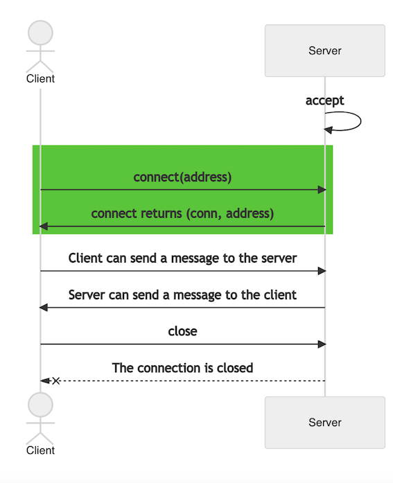

# Repetition

## Sockets from scratch


### Simple server & client

1. Copy the example to a file i.e simple-server.py in the folder lesson_8

    ```python
    import socket

    s = socket.socket(socket.AF_INET, socket.SOCK_STREAM)
    s.bind(('127.0.0.1', 50017))
    s.listen(1)
    conn, addr = s.accept()
    print('A Client Connected', addr)
    s.close()
    ```

    <div class="page"/>

2. Start the server in your terminal

    On linux & mac

    ```bash
    python3 lesson_8/simple-server.py
    ```

    On windows powershell

    ```pwsh
    py lesson_8/simple-server.py
    ```

3. Copy the example to a file i.e simple-client.py in the folder lesson_8

    ```python
    import socket

    HOST = 'localhost'
    PORT = 50017

    s = socket.socket(socket.AF_INET, socket.SOCK_STREAM)
    s.connect((HOST, PORT))
    s.close()
    ```

4. Start the client in another terminal

    On linux & mac

    ```bash
    python3 lesson_8/simple-client.py
    ```

    On windows powershell

    ```pwsh
    py lesson_8/simple-client.py
    ```

5. The server should print "A Client Connected"
    <div class="page"/>

### Context Manager

Closing the connection at the end of the code `s.close()` is not optimal if the program crashes, since you may then not call the close command. Python has a convenient keyword `with` that you maybe has used before with [files](https://docs.python.org/3/tutorial/inputoutput.html#reading-and-writing-files).

1. Modify the `simple-server.py` code to use the `with` keyword:

    ```python
    with socket.socket(socket.AF_INET, socket.SOCK_STREAM) as s:
        s.bind(('127.0.0.1', 50017)) # The code should be indented
    ```

2. Remove `s.close()` since its not needed any more

3. Modify the `simple-client.py` in the same way

    ```python
    with socket.socket(socket.AF_INET, socket.SOCK_STREAM) as s:
        s.connect(('127.0.0.1', 50017))
    ```

    <div class="page"/>

### Server & Client communication



When the server is setup it will wait for a connection, this is possible because `accept()` is `blocking` the program. When the client call the method `connect()` it will perform a three way handshake and establish a socket connection between the server and client.

<div class="page"/>

- The server will get a new socket object `conn` returned from [accept](https://docs.python.org/3/library/socket.html#socket.socket.accept), usable to send and receive data on the connection.

    ```python
    with socket.socket(socket.AF_INET, socket.SOCK_STREAM) as s:
        s.bind(('127.0.0.1', 50017))
        s.listen(1)
        conn, addr = s.accept()

    ```

- The client use the previously created sockets method [connect](https://docs.python.org/3/library/socket.html#socket.socket.connect).

    ```python
    with socket.socket(socket.AF_INET, socket.SOCK_STREAM) as s:
        s.connect(('127.0.0.1', 50017))
    ```

1. Send a message to the server using [sendall](https://docs.python.org/3/library/socket.html#socket.socket.sendall):

    ```python
    s.sendall(b'hello')
    ```

2. We need to modify the server since it doesn't [recv](https://docs.python.org/3/library/socket.html#socket.socket.recv) messages. Remember that conn is the established connection.

    ```python
    message = conn.recv(4096)
    print(message)
    ```

3. The server should print `b'hello'`

<div class="page"/>

### Loop to stay alive

Now the server is closed down after a successful recv. We will add a loop so the server will keep recv messages.

1. Add the following code to the server:

    ```python
    while True:
        message = conn.recv(4096)
        print(message)
    ```

2. Now the server should print `b'hello'` once but then start looping printing `b''`. When a connection is closed the recv will return a empty byte. So we need to handle the situation when a socket is closed by the client. When this happens we just break the while loop.

    ```python
    while True:
        message = conn.recv(4096)
        if not message:
            break
        print(message)
    ```

3. The server will stop executing when the client close the connection. To keep the server running it needs to block or loop in the code. If we add another loop before the [accept](https://docs.python.org/3/library/socket.html#socket.socket.accept) it will wait for a new connection when the old one was closed.

    ```python
    while True:
        conn, addr = s.accept()
    ```

## Hand in instructions

No hand in this exercise.
