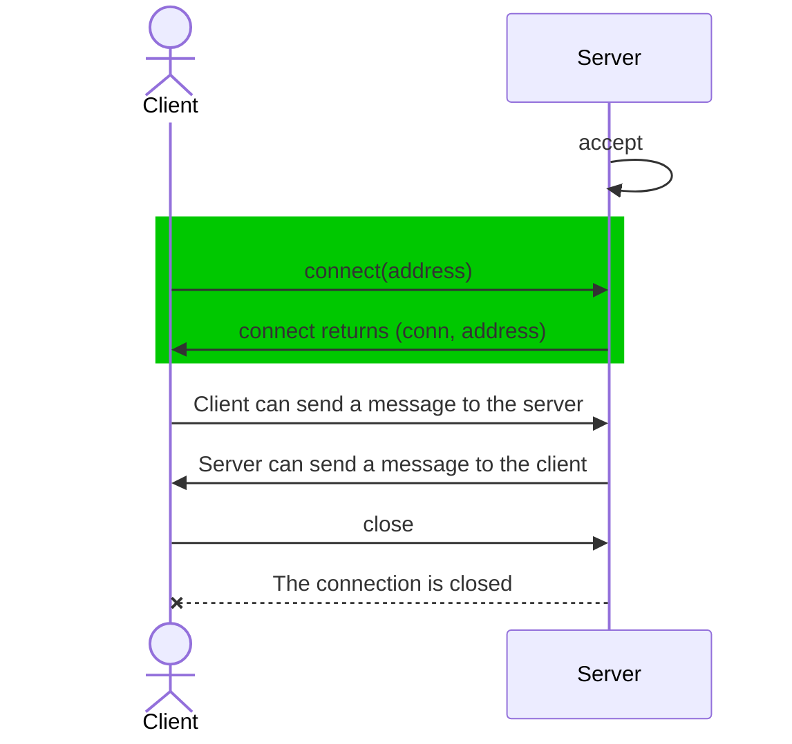
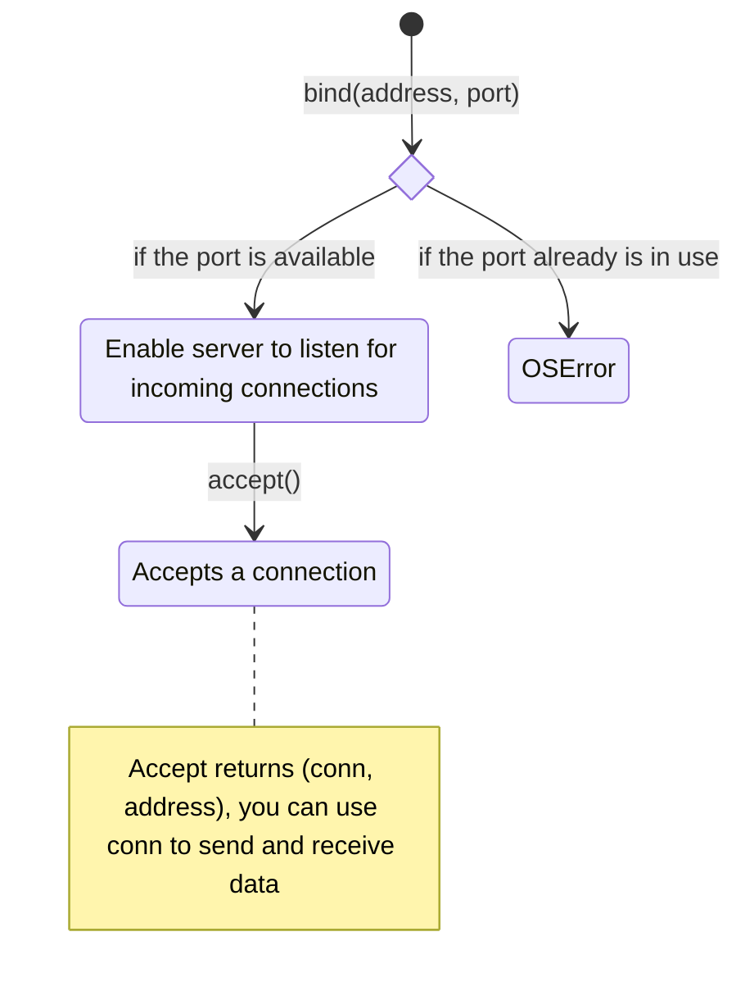

```mermaid
sequenceDiagram
    actor Client
    Server->>Server: accept
    rect rgb(0, 200, 0)
        Client->>Server: connect(address)
        Server->>Client: connect returns (conn, address)
    end
    Client->>Server: Client can send a message to the server
    Server->>Client: Server can send a message to the client
    Client->>Server: close
    Server--xClient: The connection is closed
```

```mermaid
stateDiagram-v2
    state if_bind <<choice>>
    listen: Enable server to listen for incoming connections
    accept: Accepts a connection
    note right of accept: Accept returns (conn, address), you can use conn to send and receive data
    
    [*] --> if_bind: bind(address, port)
    if_bind --> listen : if the port is available
    if_bind --> OSError : if the port already is in use
    listen --> accept : accept()
```
