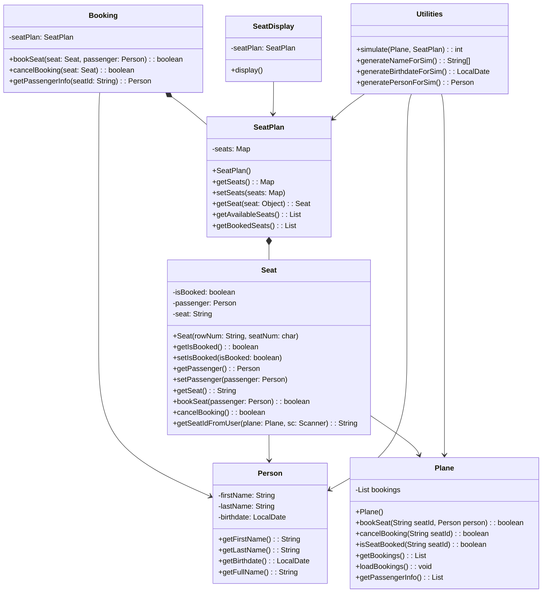

# Class diagram

```bash
"*--" Booking has a composition relationship with SeatPlan, as it contains a SeatPlan object.
"-->" Booking has an association relationship with Person, as it uses Person objects to book seats.
"-->" Seat has an association relationship with Person, as it contains a Person object representing the passenger who booked it.
"-->" Seat has an association relationship with Plane, as it uses a Plane object to check if a seat is booked or not.
"-->" SeatDisplay has an association relationship with SeatPlan, as it uses a SeatPlan object to display the seat plan of a plane.
"*--" SeatPlan has a composition relationship with Seat, as it contains a map of Seat objects.
"-->" Utilities has an association relationship with Plane and SeatPlan, as it uses these objects to simulate bookings.
"-->" Utilities has an association relationship with Person, as it uses Person objects to generate random bookings.
```
# NOUNS
```bash
* Plane
* Person
* Booking
* InvalidSeatException
* Seat
* SeatDisplay 
* SeatPlan
* Utilities
```
# VERBS
```bash
* Load bookings
* Check if seat is booked
* Get FirstName
* Get LastName
* Get birthdate
* Get fullName
* Book a seat
* Cancel a booking
* Get passenger inforomation
* Set a seat as booked
* Get passenger of a seat
* Set passenger of a seat
* Get seat id from user
* Display seat plan
* Simulate
* Generate name for siumlation
* Generate birthdate for simulation
* Generate person for simulation
* Get a list of all passengers
```

    
