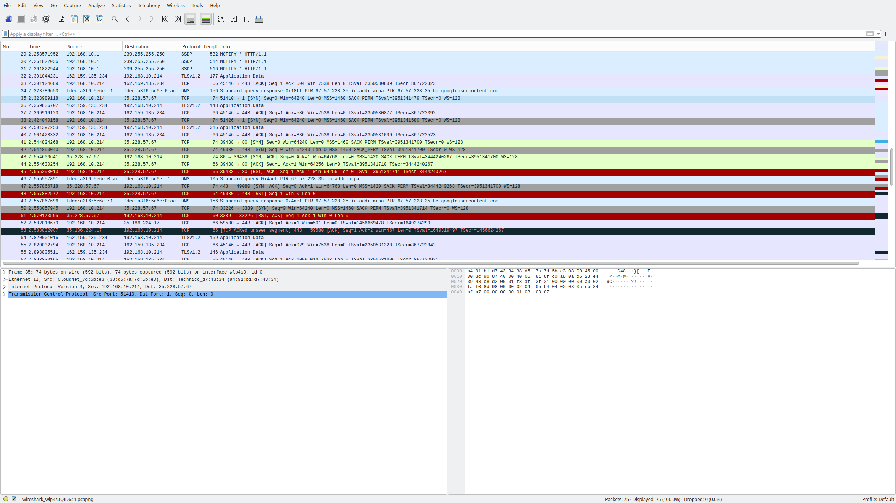

# Inlämningsuppgift 1
## Fredrik Magnusson
## 2021-05-24

# Table of Contents
- [Inlämningsuppgift 1](#inlämningsuppgift-1)
  - [Fredrik Magnusson](#fredrik-magnusson)
  - [2021-05-24](#2021-05-24)
- [Table of Contents](#table-of-contents)
- [Labb del 1 - G](#labb-del-1---g)
  - [35.228.57.67](#352285767)
    - [Ports](#ports)
    - [Övrig nmap scan information](#övrig-nmap-scan-information)
      - [Aggressive OS guesses:](#aggressive-os-guesses)
  - [209.85.175.193](#20985175193)
- [Labb del 2 - VG](#labb-del-2---vg)
  - [Port 3389](#port-3389)
  - [Port 1](#port-1)
  - [Vad är skillnaden på closed och filtered?](#vad-är-skillnaden-på-closed-och-filtered)

# Labb del 1 - G
```bash
    ~  sudo traceroute -I www.cuebid.se  ✔  27s   16:05:03  
traceroute to www.cuebid.se (35.228.57.67), 30 hops max, 60 byte packets
 1  _gateway (192.168.10.1)  6.220 ms  6.184 ms  6.176 ms
 2  ti3105a430.ti.telenor.net (146.172.70.216)  6.170 ms  6.166 ms  6.160 ms
 3  ti3001c360-ae30-0.ti.telenor.net (146.172.15.162)  6.219 ms  6.177 ms  6.172 ms
 4  ti3001b400-ae4-0.ti.telenor.net (146.172.105.29)  6.096 ms  6.087 ms  6.143 ms
 5  209.85.175.193 (209.85.175.193)  6.139 ms * *
 6  67.57.228.35.bc.googleusercontent.com (35.228.57.67)  16.083 ms  12.814 ms  12.776 ms
```

Traceroute visar mig vägen som trafiken tar från min dator tills jag når `www.cuebid.se`, dom två sista ip adresserna representerar de två sista hoppen, där den sista(35.228.57.67) är `www.cuebid.se` och näst sista(209.85.175.193) är en annan nod, vad för typ kommer vi kanske få reda på senare nr vi kör nmap mot den adressen.

---------------

## 35.228.57.67

```bash
    ~  sudo nmap -A -O -vvv 35.228.57.67                                                                                                                                                                                         ✔  32s   20:32:15  
Starting Nmap 7.93 ( https://nmap.org ) at 2023-05-24 20:32 CEST
NSE: Loaded 155 scripts for scanning.
NSE: Script Pre-scanning.
NSE: Starting runlevel 1 (of 3) scan.
Initiating NSE at 20:32
Completed NSE at 20:32, 0.00s elapsed
NSE: Starting runlevel 2 (of 3) scan.
Initiating NSE at 20:32
Completed NSE at 20:32, 0.00s elapsed
NSE: Starting runlevel 3 (of 3) scan.
Initiating NSE at 20:32
Completed NSE at 20:32, 0.00s elapsed
Initiating Ping Scan at 20:32
Scanning 35.228.57.67 [4 ports]
Completed Ping Scan at 20:32, 0.04s elapsed (1 total hosts)
Initiating Parallel DNS resolution of 1 host. at 20:32
Completed Parallel DNS resolution of 1 host. at 20:32, 0.46s elapsed
DNS resolution of 1 IPs took 0.46s. Mode: Async [#: 2, OK: 1, NX: 0, DR: 0, SF: 0, TR: 1, CN: 0]
Initiating SYN Stealth Scan at 20:32
Scanning 67.57.228.35.bc.googleusercontent.com (35.228.57.67) [1000 ports]
Discovered open port 80/tcp on 35.228.57.67
Discovered open port 22/tcp on 35.228.57.67
Discovered open port 8022/tcp on 35.228.57.67
Discovered open port 443/tcp on 35.228.57.67
Completed SYN Stealth Scan at 20:32, 4.47s elapsed (1000 total ports)
Initiating Service scan at 20:32
Scanning 4 services on 67.57.228.35.bc.googleusercontent.com (35.228.57.67)
Completed Service scan at 20:32, 12.07s elapsed (4 services on 1 host)
Initiating OS detection (try #1) against 67.57.228.35.bc.googleusercontent.com (35.228.57.67)
Retrying OS detection (try #2) against 67.57.228.35.bc.googleusercontent.com (35.228.57.67)
Initiating Traceroute at 20:32
Completed Traceroute at 20:32, 0.02s elapsed
Initiating Parallel DNS resolution of 5 hosts. at 20:32
Completed Parallel DNS resolution of 5 hosts. at 20:32, 0.01s elapsed
DNS resolution of 5 IPs took 0.01s. Mode: Async [#: 2, OK: 4, NX: 1, DR: 0, SF: 0, TR: 5, CN: 0]
NSE: Script scanning 35.228.57.67.
NSE: Starting runlevel 1 (of 3) scan.
Initiating NSE at 20:32
Completed NSE at 20:32, 5.10s elapsed
NSE: Starting runlevel 2 (of 3) scan.
Initiating NSE at 20:32
Completed NSE at 20:33, 1.26s elapsed
NSE: Starting runlevel 3 (of 3) scan.
Initiating NSE at 20:33
Completed NSE at 20:33, 0.00s elapsed
Nmap scan report for 67.57.228.35.bc.googleusercontent.com (35.228.57.67)
Host is up, received syn-ack ttl 59 (0.013s latency).
Scanned at 2023-05-24 20:32:32 CEST for 28s
Not shown: 991 filtered tcp ports (no-response)
PORT      STATE  SERVICE       REASON         VERSION
20/tcp    closed ftp-data      reset ttl 58
21/tcp    closed ftp           reset ttl 58
22/tcp    open   ssh           syn-ack ttl 58 OpenSSH 7.6p1 Ubuntu 4ubuntu0.5 (Ubuntu Linux; protocol 2.0)
| ssh-hostkey: 
|   2048 6a621b4626c070e3fce39229bb7dc75b (RSA)
| ssh-rsa AAAAB3NzaC1yc2EAAAADAQABAAABAQDHWcQuPjwIZO9D03XARfbSlY52mYRD5ydTVeDvckAsWEPGrb8G4NZ4V4/XangW53oE05w44AT40MMN0NiIwkvVUg+IPDq5IRm+bg0u1EzCLxUbAxWQk/wwr6MPmYJ0KmF18RyzqOHWJ3NtGRcGBjNN2LQY/Ah5VTkL/XLiKobIrh7i6C1eQfebJAWld/He/z3U5nNT5yOrm8ROL4Qzwt8YmvuI/nHED5xvVfDAGCdVU4ijgslmiwkydyjjmmQpW0tm5yaoyddSlgibbjgl/JaYXntEXBzmTpICj5DWZUPiq5VxYwoaSn0wxZSdVHDsOTysaoHUE9z3HoPLCDe6sL4X
|   256 7a42a5159ce7fecc26023a8520eaadfc (ECDSA)
| ecdsa-sha2-nistp256 AAAAE2VjZHNhLXNoYTItbmlzdHAyNTYAAAAIbmlzdHAyNTYAAABBBJj7ffug4emoMYKmtgvfy/p3RMYS6CIo3LDV5wfd6368IfXaFc3POWDQSHxW+uokO/NYzNeiV9ukpMWB0wCtqpY=
|   256 e7bb6abde56462951c9b6d05dc075c22 (ED25519)
|_ssh-ed25519 AAAAC3NzaC1lZDI1NTE5AAAAIOMG1qU53r7g7ToQcqAeiO6oLABpICOTT2OxoUZbzZQc
80/tcp    open   http          syn-ack ttl 59 nginx
|_http-title: Did not follow redirect to https://67.57.228.35.bc.googleusercontent.com/
| http-methods: 
|_  Supported Methods: GET HEAD POST OPTIONS
443/tcp   open   ssl/http      syn-ack ttl 59 nginx
| tls-alpn: 
|   h2
|_  http/1.1
|_ssl-date: TLS randomness does not represent time
| ssl-cert: Subject: commonName=*.templtrial.com
| Subject Alternative Name: DNS:*.templcdn.com, DNS:*.templtrial.com, DNS:*.templweb.com
| Issuer: commonName=R3/organizationName=Let's Encrypt/countryName=US
| Public Key type: rsa
| Public Key bits: 2048
| Signature Algorithm: sha256WithRSAEncryption
| Not valid before: 2023-04-21T08:57:39
| Not valid after:  2023-07-20T08:57:38
| MD5:   0bd508f6a93722c4443c5b8de075bde1
| SHA-1: aa7a62f001c87bca9361b4bd3cc4dc823e94e14f
| -----BEGIN CERTIFICATE-----
| MIIFRjCCBC6gAwIBAgISBOV4sNraKtfqxTLn6UQjF63wMA0GCSqGSIb3DQEBCwUA
| MDIxCzAJBgNVBAYTAlVTMRYwFAYDVQQKEw1MZXQncyBFbmNyeXB0MQswCQYDVQQD
| EwJSMzAeFw0yMzA0MjEwODU3MzlaFw0yMzA3MjAwODU3MzhaMBsxGTAXBgNVBAMM
| ECoudGVtcGx0cmlhbC5jb20wggEiMA0GCSqGSIb3DQEBAQUAA4IBDwAwggEKAoIB
| AQCyD7pjr4FzFxyiMyba07SqDSj1XgOIluvtZZSvzusN0f/cy9pk0iyXeukdltDw
| yj/3o+ocsOKvQNe1Z5alg6TCF0+Z4HvVlvfHm8O/bIICfh5kJm/3TEbUKrvZdvFM
| 2lEEqxXf8NHVNPpulgE2PhlRdTknTy8eiPtwjlY4BxqYjYXJOFIN3vob6cgUukEr
| bgEow3XARNgr/RVVfy3Rm5W3kqEGQHARhQWM0W70BUkiaNGY4Ik3LSmUPltXJQT3
| EiJ3Ax7XM1asSR+BW879WQFQmKlw3utzDQdTrHSHOPCt9N/lD4YcW4nI4fciFgxl
| PfG1xhe6B4+HuBJ1MsHoutMnAgMBAAGjggJrMIICZzAOBgNVHQ8BAf8EBAMCBaAw
| HQYDVR0lBBYwFAYIKwYBBQUHAwEGCCsGAQUFBwMCMAwGA1UdEwEB/wQCMAAwHQYD
| VR0OBBYEFFwpsY7j4CX9KIHsGSre+mqnVDqKMB8GA1UdIwQYMBaAFBQusxe3WFbL
| rlAJQOYfr52LFMLGMFUGCCsGAQUFBwEBBEkwRzAhBggrBgEFBQcwAYYVaHR0cDov
| L3IzLm8ubGVuY3Iub3JnMCIGCCsGAQUFBzAChhZodHRwOi8vcjMuaS5sZW5jci5v
| cmcvMDsGA1UdEQQ0MDKCDioudGVtcGxjZG4uY29tghAqLnRlbXBsdHJpYWwuY29t
| gg4qLnRlbXBsd2ViLmNvbTBMBgNVHSAERTBDMAgGBmeBDAECATA3BgsrBgEEAYLf
| EwEBATAoMCYGCCsGAQUFBwIBFhpodHRwOi8vY3BzLmxldHNlbmNyeXB0Lm9yZzCC
| AQQGCisGAQQB1nkCBAIEgfUEgfIA8AB1AHoyjFTYty22IOo44FIe6YQWcDIThU07
| 0ivBOlejUutSAAABh6M/fQsAAAQDAEYwRAIgRYh1XRgQXhwXFTWsInmGEtAzPDe5
| BKypRQeX1NRVi1YCIE7U+dz5tbJHEUswSimiv4bL2tDqWLWOVC/VV0NeUcKRAHcA
| rfe++nz/EMiLnT2cHj4YarRnKV3PsQwkyoWGNOvcgooAAAGHoz99YAAABAMASDBG
| AiEAjrc3g3Np43XVtpTpvnGP2Kw/bSoJGZiUFRl3pAW4EuUCIQDzAMaSsswctm3H
| W36fCtfmi/xmA5HzwKuPUZnpgTzdaTANBgkqhkiG9w0BAQsFAAOCAQEApEgj0PtO
| gCMZ/aII+dtGzKR6Ka+ueRjRQhmHitTktbgbmom8XH5zhZnVA+5n2WF/bx8ED5Ud
| 8rKBKvoREYmlrTeAu+ocIuVhvGsxFozFO0o5VY1MxFqoDs/cqtkBjNeX5fxaK5+u
| qQWrkTOiJTfHxXoSU7Iz5lGydeA+9PQjbB/ODtE3W9PhWkoVIVsl7gGy1RSBsQcD
| Uj1Dmyq9QbeiCwL1+D9zV9BYLUW86tm1q3UbxU3ecPJSD2HFbM25mIWDxyp1JNxv
| 3qkyZ+cVhCoXExPItW/iEG2uYFC0uOmjBvN9XMHpHLgeB5Hvagy0HZXgiZ2RzuFx
| 9fzeuHVbkcD48g==
|_-----END CERTIFICATE-----
|_http-title: 404 Not Found
3389/tcp  closed ms-wbt-server reset ttl 58
8022/tcp  open   ssh           syn-ack ttl 59 OpenSSH 7.6p1 Ubuntu 4ubuntu0.5 (Ubuntu Linux; protocol 2.0)
| ssh-hostkey: 
|   2048 6a621b4626c070e3fce39229bb7dc75b (RSA)
| ssh-rsa AAAAB3NzaC1yc2EAAAADAQABAAABAQDHWcQuPjwIZO9D03XARfbSlY52mYRD5ydTVeDvckAsWEPGrb8G4NZ4V4/XangW53oE05w44AT40MMN0NiIwkvVUg+IPDq5IRm+bg0u1EzCLxUbAxWQk/wwr6MPmYJ0KmF18RyzqOHWJ3NtGRcGBjNN2LQY/Ah5VTkL/XLiKobIrh7i6C1eQfebJAWld/He/z3U5nNT5yOrm8ROL4Qzwt8YmvuI/nHED5xvVfDAGCdVU4ijgslmiwkydyjjmmQpW0tm5yaoyddSlgibbjgl/JaYXntEXBzmTpICj5DWZUPiq5VxYwoaSn0wxZSdVHDsOTysaoHUE9z3HoPLCDe6sL4X
|   256 7a42a5159ce7fecc26023a8520eaadfc (ECDSA)
| ecdsa-sha2-nistp256 AAAAE2VjZHNhLXNoYTItbmlzdHAyNTYAAAAIbmlzdHAyNTYAAABBBJj7ffug4emoMYKmtgvfy/p3RMYS6CIo3LDV5wfd6368IfXaFc3POWDQSHxW+uokO/NYzNeiV9ukpMWB0wCtqpY=
|   256 e7bb6abde56462951c9b6d05dc075c22 (ED25519)
|_ssh-ed25519 AAAAC3NzaC1lZDI1NTE5AAAAIOMG1qU53r7g7ToQcqAeiO6oLABpICOTT2OxoUZbzZQc
22939/tcp closed unknown       reset ttl 59
23502/tcp closed unknown       reset ttl 59
OS fingerprint not ideal because: Didn't receive UDP response. Please try again with -sSU
Aggressive OS guesses: Android 5.0.1 (92%), Linux 2.6.32 (92%), Linux 2.6.32 or 3.10 (92%), Linux 2.6.35 (92%), Linux 2.6.39 (92%), Linux 3.10 - 3.12 (92%), Linux 4.4 (92%), Linux 4.9 (92%), Synology DiskStation Manager 5.1 (92%), DD-WRT v24-sp1 (Linux 2.4) (91%)
No exact OS matches for host (test conditions non-ideal).
TCP/IP fingerprint:
SCAN(V=7.93%E=4%D=5/24%OT=22%CT=20%CU=%PV=N%DS=6%DC=T%G=N%TM=646E585C%P=x86_64-pc-linux-gnu)
SEQ(SP=101%GCD=1%ISR=10F%TI=Z%II=I%TS=A)
ECN(R=Y%DF=Y%TG=40%W=FF28%O=M58CNNSNW7%CC=Y%Q=)
T1(R=Y%DF=Y%TG=40%S=O%A=S+%F=AS%RD=0%Q=)
T2(R=N)
T3(R=N)
T4(R=N)
T5(R=N)
T6(R=N)
T7(R=N)
U1(R=N)
IE(R=Y%DFI=N%TG=40%CD=S)

Uptime guess: 39.799 days (since Sat Apr 15 01:22:23 2023)
Network Distance: 6 hops
TCP Sequence Prediction: Difficulty=257 (Good luck!)
IP ID Sequence Generation: All zeros
Service Info: OS: Linux; CPE: cpe:/o:linux:linux_kernel

TRACEROUTE (using port 21/tcp)
HOP RTT      ADDRESS
1   3.23 ms  dsldevice.lan (192.168.10.1)
2   3.24 ms  ti3105a430.ti.telenor.net (146.172.70.216)
3   6.53 ms  ti3163c360-ae29-0.ti.telenor.net (146.172.15.166)
4   3.26 ms  ti3001b400-ae3-0.ti.telenor.net (146.172.105.62)
5   6.55 ms  209.85.175.193
6   13.54 ms 67.57.228.35.bc.googleusercontent.com (35.228.57.67)

NSE: Script Post-scanning.
NSE: Starting runlevel 1 (of 3) scan.
Initiating NSE at 20:33
Completed NSE at 20:33, 0.00s elapsed
NSE: Starting runlevel 2 (of 3) scan.
Initiating NSE at 20:33
Completed NSE at 20:33, 0.00s elapsed
NSE: Starting runlevel 3 (of 3) scan.
Initiating NSE at 20:33
Completed NSE at 20:33, 0.00s elapsed
Read data files from: /usr/bin/../share/nmap
OS and Service detection performed. Please report any incorrect results at https://nmap.org/submit/ .
Nmap done: 1 IP address (1 host up) scanned in 28.45 seconds
           Raw packets sent: 2093 (95.872KB) | Rcvd: 37 (2.410KB)
```

### Ports
```bash
    ~  sudo nmap 35.228.57.67  ✔  29s   20:33:00  
Starting Nmap 7.93 ( https://nmap.org ) at 2023-05-24 20:33 CEST
Nmap scan report for 67.57.228.35.bc.googleusercontent.com (35.228.57.67)
Host is up (0.012s latency).
Not shown: 991 filtered tcp ports (no-response)
PORT      STATE  SERVICE
20/tcp    closed ftp-data
21/tcp    closed ftp
22/tcp    open   ssh
80/tcp    open   http
443/tcp   open   https
3389/tcp  closed ms-wbt-server
8022/tcp  open   oa-system
22939/tcp closed unknown
23502/tcp closed unknown

Nmap done: 1 IP address (1 host up) scanned in 4.48 seconds
```
* 20/tcp (FTP Data): 
* * Den här porten används normalt för dataöverföring i File Transfer Protocol (FTP). Den är för närvarande i stängt tillstånd, vilket indikerar att det inte finns någon aktiv FTP-dataöverföringstjänst igång.

* 21/tcp (FTP): 
* * Detta är styrförbindelsen för FTP. Kommandon skickas över denna port från en klient för att initiera dataöverföringar och andra FTP-funktioner. Liksom port 20 är denna port också stängd, vilket tyder på att ingen aktiv FTP-tjänst är igång.

* 22/tcp (SSH): 
* * Secure Shell (SSH) använder denna port för säker fjärradministration, filöverföringar och andra funktioner. Denna port är öppen, vilket indikerar en aktiv SSH-tjänst.
* * * OpenSSH 7.6p1 Ubuntu 4ubuntu0.5 (Ubuntu Linux; protocol 2.0)

* 80/tcp (HTTP): 
* * Hypertext Transfer Protocol (HTTP) använder denna port. Det är den primära metoden som används för att överföra data på World Wide Web. Denna port är öppen, vilket indikerar en aktiv HTTP-tjänst.

* 443/tcp (HTTPS): 
* * Hypertext Transfer Protocol Secure (HTTPS) använder denna port för säker webbläsarkommunikation. Denna port är öppen, vilket indikerar en aktiv HTTPS-tjänst.

* 3389/tcp (MS WBT Server): 
* * Denna port används normalt av Microsofts Remote Desktop-tjänst för att tillåta fjärrskrivbordsanslutningar. Den är för närvarande stängd, vilket betyder att ingen aktiv Remote Desktop-tjänst är igång.

* 8022/tcp (OA System): 
* * Även om den inte är universellt känd, används port 8022 ofta för alternativ till SSH. I detta fall är den öppen, vilket indikerar att någon tjänst är aktiv.
* * * OpenSSH 7.6p1 Ubuntu 4ubuntu0.5 (Ubuntu Linux; protocol 2.0)

* 22939/tcp och 23502/tcp (Okänd): 
* * Dessa portar har inte en universellt accepterad tjänst associerad med dem och används ofta för en mängd olika applikationer. De är båda stängda, vilket indikerar att inga aktiva tjänster använder dessa portar.

### Övrig nmap scan information 
Nmap rapporterar till mig att detta rör sig om en Linux server som kör webbtjänster genom nginx
Nmap gissar dock på en massa konstiga saker också 

#### Aggressive OS guesses: 
* Android 5.0.1 (92%), 
* Linux 2.6.32 (92%), 
* Linux 2.6.32 or 3.10 (92%), 
* Linux 2.6.35 (92%), 
* Linux 2.6.39 (92%), 
* Linux 3.10 - 3.12 (92%), 
* Linux 4.4 (92%), 
* Linux 4.9 (92%), 
* Synology DiskStation Manager 5.1 (92%), 
* DD-WRT v24-sp1 (Linux 2.4) (91%)

men ingen av dessa förutom kanske `Linux 4.9` känns trolig.
Jag baserar min gissning på det som känns mest troligt och informationen jag får från andra håll i nmap scannen.

Annat intressant som jag kan se är att SSL certifikatet är utfärdat av Let's Encrypt som är en välkänd utförare av SSL certifikat.

----------------

## 209.85.175.193
```bash
    ~  sudo nmap 209.85.175.193  ✔  16:05:05  
Starting Nmap 7.93 ( https://nmap.org ) at 2023-05-24 16:25 CEST
Nmap scan report for 209.85.175.193
Host is up (0.0070s latency).
All 1000 scanned ports on 209.85.175.193 are in ignored states.
Not shown: 1000 filtered tcp ports (no-response)

Nmap done: 1 IP address (1 host up) scanned in 21.30 seconds
```
```bash
    ~  sudo nmap -A -O -vvv 209.85.175.193  ✔  32s   20:02:43  
Starting Nmap 7.93 ( https://nmap.org ) at 2023-05-24 20:05 CEST
NSE: Loaded 155 scripts for scanning.
NSE: Script Pre-scanning.
NSE: Starting runlevel 1 (of 3) scan.
Initiating NSE at 20:05
Completed NSE at 20:05, 0.00s elapsed
NSE: Starting runlevel 2 (of 3) scan.
Initiating NSE at 20:05
Completed NSE at 20:05, 0.00s elapsed
NSE: Starting runlevel 3 (of 3) scan.
Initiating NSE at 20:05
Completed NSE at 20:05, 0.00s elapsed
Initiating Ping Scan at 20:05
Scanning 209.85.175.193 [4 ports]
Completed Ping Scan at 20:05, 0.05s elapsed (1 total hosts)
Initiating Parallel DNS resolution of 1 host. at 20:05
Completed Parallel DNS resolution of 1 host. at 20:05, 0.01s elapsed
DNS resolution of 1 IPs took 0.01s. Mode: Async [#: 2, OK: 0, NX: 1, DR: 0, SF: 0, TR: 1, CN: 0]
Initiating SYN Stealth Scan at 20:05
Scanning 209.85.175.193 [1000 ports]
Completed SYN Stealth Scan at 20:05, 21.14s elapsed (1000 total ports)
Initiating Service scan at 20:05
Initiating OS detection (try #1) against 209.85.175.193
Retrying OS detection (try #2) against 209.85.175.193
Initiating Traceroute at 20:05
Completed Traceroute at 20:05, 0.02s elapsed
Initiating Parallel DNS resolution of 5 hosts. at 20:05
Completed Parallel DNS resolution of 5 hosts. at 20:05, 0.00s elapsed
DNS resolution of 5 IPs took 0.00s. Mode: Async [#: 2, OK: 4, NX: 1, DR: 0, SF: 0, TR: 5, CN: 0]
NSE: Script scanning 209.85.175.193.
NSE: Starting runlevel 1 (of 3) scan.
Initiating NSE at 20:05
Completed NSE at 20:05, 5.00s elapsed
NSE: Starting runlevel 2 (of 3) scan.
Initiating NSE at 20:05
Completed NSE at 20:05, 0.00s elapsed
NSE: Starting runlevel 3 (of 3) scan.
Initiating NSE at 20:05
Completed NSE at 20:05, 0.00s elapsed
Nmap scan report for 209.85.175.193
Host is up, received echo-reply ttl 59 (0.0051s latency).
Scanned at 2023-05-24 20:05:13 CEST for 29s
All 1000 scanned ports on 209.85.175.193 are in ignored states.
Not shown: 1000 filtered tcp ports (no-response)
Too many fingerprints match this host to give specific OS details
TCP/IP fingerprint:
SCAN(V=7.93%E=4%D=5/24%OT=%CT=%CU=%PV=N%DS=5%DC=T%G=N%TM=646E51F6%P=x86_64-pc-linux-gnu)
SEQ(II=RI)
U1(R=N)
IE(R=Y%DFI=S%TG=40%CD=S)

Network Distance: 5 hops

TRACEROUTE (using proto 1/icmp)
HOP RTT     ADDRESS
1   3.54 ms dsldevice.lan (192.168.10.1)
2   3.55 ms ti3105a430.ti.telenor.net (146.172.70.216)
3   6.80 ms ti3001c360-ae30-0.ti.telenor.net (146.172.15.162)
4   3.57 ms ti3001b400-ae4-0.ti.telenor.net (146.172.105.29)
5   3.70 ms 209.85.175.193

NSE: Script Post-scanning.
NSE: Starting runlevel 1 (of 3) scan.
Initiating NSE at 20:05
Completed NSE at 20:05, 0.00s elapsed
NSE: Starting runlevel 2 (of 3) scan.
Initiating NSE at 20:05
Completed NSE at 20:05, 0.00s elapsed
NSE: Starting runlevel 3 (of 3) scan.
Initiating NSE at 20:05
Completed NSE at 20:05, 0.00s elapsed
Read data files from: /usr/bin/../share/nmap
OS and Service detection performed. Please report any incorrect results at https://nmap.org/submit/ .
Nmap done: 1 IP address (1 host up) scanned in 29.09 seconds
           Raw packets sent: 2050 (93.148KB) | Rcvd: 15 (1.130KB)
```

Att alla 1000 scannade portar är filtrerade säger till mig att detta är en brandvägg.
Och det är inte möjligt för mig att ta reda på vilket OS eller andra intressanta saker om systemet, allt jag gör blir blockerat.

------------ 

# Labb del 2 - VG


I min bild ovan kan man se aktiviteten på portarna 3389(closed) och 1(filtered)

Jag har även bifogat wireshark capture filen på studentportalen

frame 35, 38, 50 & 51 är kopplade till closed och filtered

------------

## Port 3389


Man kan också se att jag anropar port 3389 så får jag tillbaka ett svar om att det inte finns någon tjänst som kör på den porten, eller ja, mer specifikt får jag tillbaka som svar "connection refused", jag tillåts inte att ansluta till den porten men det är ju för att den är closed då ingen applikation körs på den porten
Det är därför jag får tillbaka [RST, ACK]

## Port 1


På port 1 därför så får jag inget svar överhuvudtaget tillbaka. Jag anropar porten, men ingen svar.
Där igenom så kan jag inte veta om porten är open eller closed och därför sätts den till filtered
Och därför händer det inget heller efter jag skickar [SYN] till porten,

------------

## Vad är skillnaden på closed och filtered?

* Filtered innebär att nmap inte vet om porten är öppen eller stängd för att något på vägen hindrar nmap. Det kan vara en brandvägg, något slags filter eller annat hinder.
* Closed innebär att nmap vet att porten är stängd för att den har fått ett svar från hosten att porten är stängd. 
* * Och det innebär i sin tur att det inte finns något tjänst som lyssnar på porten.
* * * En closed port kommer att ändras till Open så snart där är en tjänst som använder sig av porten.

