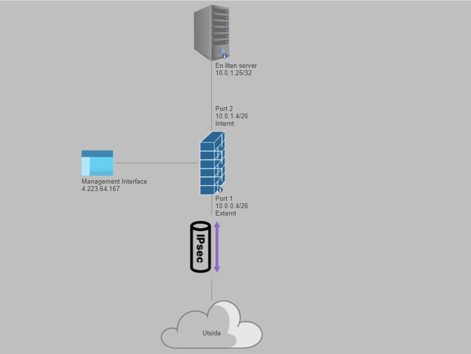
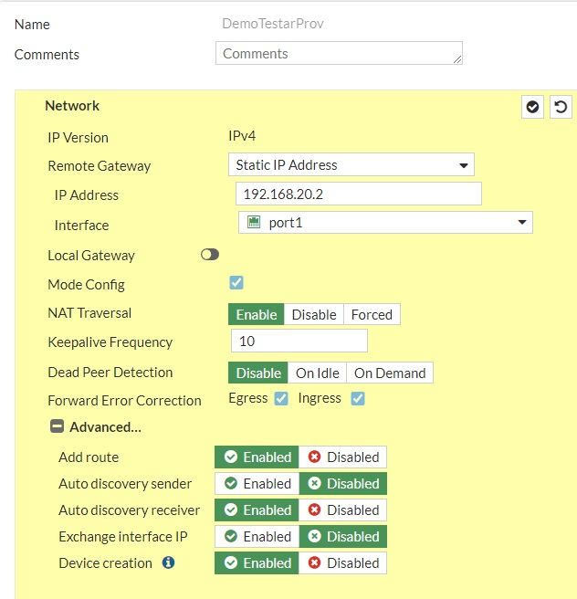
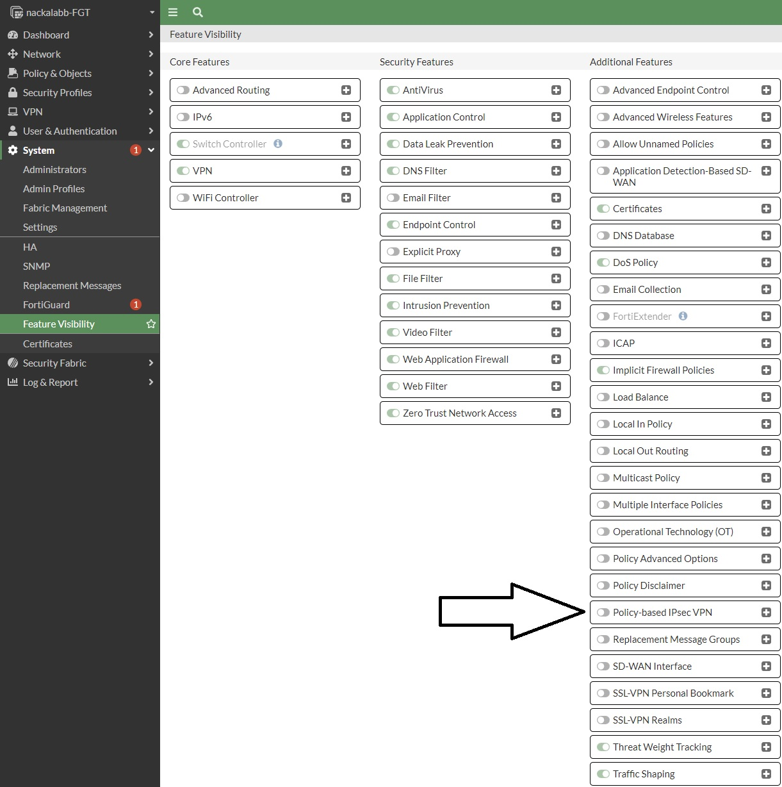

# Laboration 2/Demo - Fortinet Fortigate - Report

- [Laboration 2/Demo - Fortinet Fortigate - Report](#laboration-2demo---fortinet-fortigate---report)
- [Introduktion](#introduktion)
- [Uppgift 2: Nätverksinställningar](#uppgift-2-nätverksinställningar)
  - [Management interface](#management-interface)
- [Uppgift 3: Brandväggsregler](#uppgift-3-brandväggsregler)
    - [Policy: port1 → port2](#policy-port1--port2)
    - [Stateful Packet Filter \& Application Level Proxy](#stateful-packet-filter--application-level-proxy)
- [Uppgift 4: Webbfilter-kategorier](#uppgift-4-webbfilter-kategorier)
- [Uppgift 5: IPS-signaturer](#uppgift-5-ips-signaturer)
- [Uppgift 6: IPsec-tunnel "DemoTestarProv"](#uppgift-6-ipsec-tunnel-demotestarprov)
  - [Routebased eller Policybased?](#routebased-eller-policybased)
- [Slutsats](#slutsats)
    - [Author](#author)

# Introduktion
I denna rapport kommer jag att utforska konfigurationen och funktionerna hos brandväggen Fortinet Fortigate. Syftet med denna laboration var att bekanta mig med brandväggens förmågor som en "Stateful packet filter" och en "Application Level Proxy". Dessutom undersökte jag konfigurationen av en IPsec-tunnel. Rapporten ger en översikt över resultaten från varje uppgift.

# Uppgift 2: Nätverksinställningar
I denna uppgift granskade jag brandväggens nätverksinställningar. Nätskissen illustrerar anslutningen och IP-adresserna för brandväggens gränssnitt. Jag observerade att brandväggen har två gränssnitt:

* Port 1: Ansluten till det externa nätverket med IP-adressen 10.0.0.4/255.255.255.192.
* Port 2: Ansluten till en server (En liten server) med IP-adressen 10.0.1.4/255.255.255.192.

## Management interface

Den är inte listad för att den används för att konfigurera hårdvaran och inte dirigera trafiken.

# Uppgift 3: Brandväggsregler
* DemoTestarProv är en tunnel

### Policy: port1 → port2

Denna policy gäller för trafik från "port1" till en specifik destination "En liten server". 
Då source är satt till "all" så innebär det att vilken adresser som helst via port 1 tillåts att ansluta till "En liten server" som har IP adress 10.0.1.25/32

### Stateful Packet Filter & Application Level Proxy
"Stateful Packet Filter" och "Application Level Proxy" är brandväggstekniker. En stateful packet filter håller reda på tillståndet för nätverksanslutningar och tillåter inkommande paket som hör till en känd anslutning. En application-level proxy är mer säker då den filtrerar inkommande resurser baserat på olika villkor på applikationsnivå i OSI-modellen.

I detta fallet så tolkar jag "ACCEPT"-åtgärden i  policyn som stateful packet filtering, då den tillåter inkommande paket som hör till en känd anslutning. Application-level proxy kan ses i användningen av specifika tjänster som HTTPS och ICMP

# Uppgift 4: Webbfilter-kategorier

Under security profiles > Webbfilter så finns det flera kategorier, där en av dem heter "unrated".

I "unrated" ingår allting som fortinet ännu INTE har kategoriserat
Ett exempel; 
* Låt oss säga att "github.com" inte är kategoriserad av fortinet, då hamnar den i "unrated" till då de har kategoriserat den.
* När den ör kategoriserad så kommer den att flyttas till en annan mer lämplig grupp
Anledningen till att webbsidor hamnar i "unrated" är simpelt, det är helt enkelt för att det finns alldeles för många och det kommer nya hela tiden.

Kategorier som man kan sortera på
* Local Categories (Kategorier som man definierar själv)
* Potentially Liable
* Adult/Mature Content
* Bandwidth Consuming
* Security Risk
* General Interest - Personal
* General Interest - Business
* Unrated

# Uppgift 5: IPS-signaturer

Det finns totalt 5864 IPS signatures
* 11 av dessa är informational

# Uppgift 6: IPsec-tunnel "DemoTestarProv"
Jag analyserade konfigurationen av IPsec-tunneln. 

* Remote gateway: 192.168.20.2
* Autentisering: Pre-shared Key (PSK) med IKE Version 1
* Första Fas 1-förslaget: AES128-SHA256
* Metod for nyckelhantering: Diffie-Hellman Groups 14 och 5

## Routebased eller Policybased?

* En routebased tunnel använder en virtuell tunnelgränssnitt för att dirigera trafiken till tunneln.
* En policybased tunnel använder en policy för att dirigera trafiken till tunneln.

I detta fall är det en routebased tunnel eftersom det finns ett virtuellt tunnelgränssnitt "DemoTestarProv" som är kopplat till tunneln. Detta kan ses i konfigurationen av gränssnittet "DemoTestarProv" under Network > Interfaces.
Denna teorin förstärks ytterligare när vi går in under VPN > IPSec Tunnels > DemoTestarProv och ser att vi har bundit tunneln till interface "port1" och "Add route: Enabled" stärker min teori ytterligare

Man kan även gå in under System > Feature Visibility och se att möjligheten till "Policy-based IPsec VPN" är avstängd

# Slutsats
Denna laboration har gett mig värdefulla insikter i konfigurationen av brandväggen Fortinet Fortigate. Jag har undersökt nätverksinställningar, brandväggsregler, webbfilter-kategorier och en IPsec-tunnel. Resultaten förbättrar min förståelse för brandväggens funktioner och dess förmåga att säkra nätverkskommunikationen så jag kan applicera denna kunskap i min framtida karriär om så behövs.

-------------
### Author
* Fredrik Magnusson
* 2023-05-25
* fredrik.magnusson2@yh.nackademin.se
* DevOps22